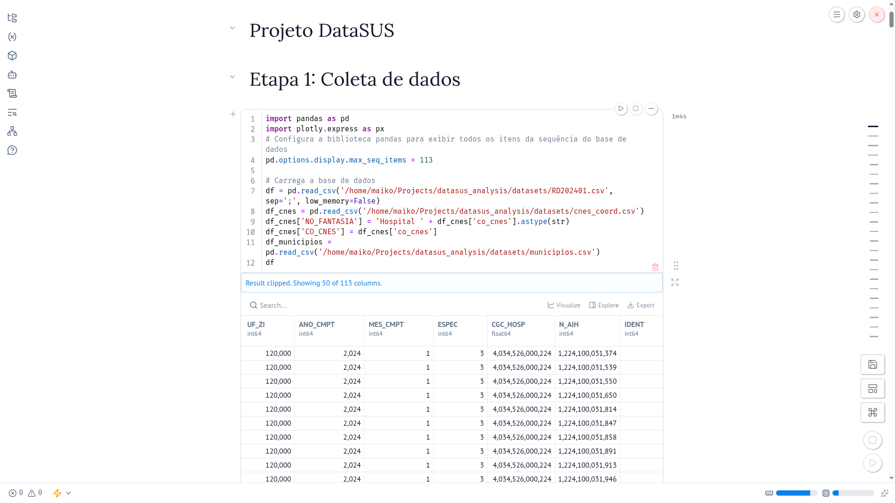
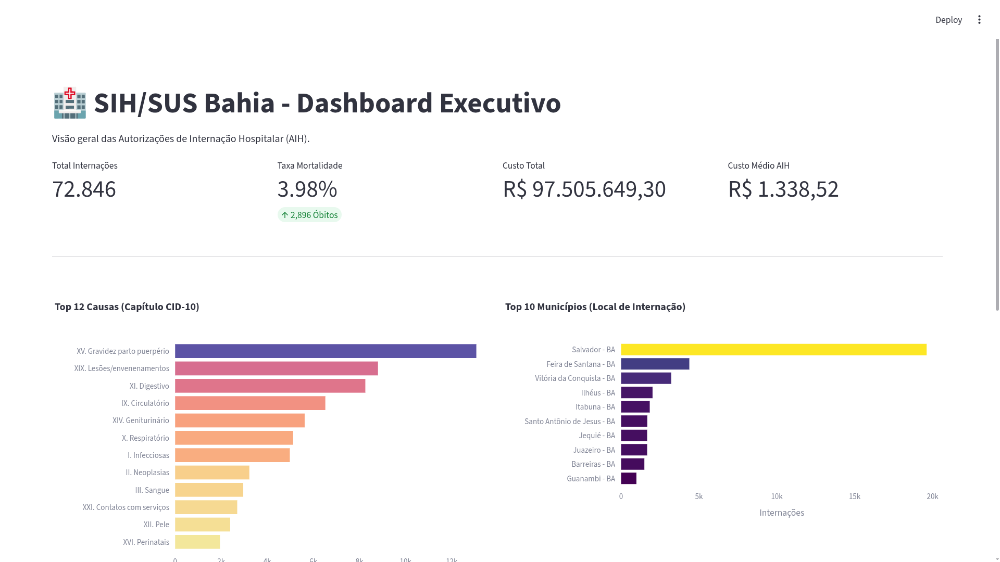

# 🏥 Projeto de Análise de Dados do DataSUS (SIH)

Este projeto foca na Análise Exploratória de Dados (EDA) de internações hospitalares do Sistema de Informações Hospitalares (SIH) do DataSUS, com foco especial no estado da Bahia.

O projeto utiliza ferramentas modernas de Python para processar volumes de dados do SUS e extrair insights estratégicos sobre a saúde pública regional.



---

## 🔍 Principais Insights (Janeiro 2024 - Bahia)

A análise dos dados de internação revelou padrões significativos sobre a saúde pública no estado:

*   **📍 Concentração Geográfica**: Salvador lidera com **19.616 internações**.
*   **👩 Gênero**: A maior parte das internações ocorre em **mulheres**.
*   **👥 Faixa Etária**: Jovens entre **20 e 29 anos** representam o maior volume de internados.
*   **⚖️ Contraste de Permanência**: Enquanto jovens (20-29) são mais frequentes, idosos (**80-89 anos**) permanecem internados por mais tempo.
*   **🚹 Permanência por Sexo**: Homens ficam mais tempo internados que as mulheres.
*   **🧬 Perfil Étnico**: A maioria dos internados se autodeclara de etnia **parda**.
*   **💀 Mortalidade**: O percentual geral de óbitos é de **3,98%**.
*   **💰 Impacto Financeiro**: 
    *   O gasto total em janeiro de 2024 foi de **R$ 94.901.326,67**.
    *   Internações que resultam em óbito possuem um custo médio significativamente superior:
        | Status | Valor Médio (R$) |
        | :--- | :--- |
        | **Com Óbito** | R$ 2.970,75 |
        | **Sem Óbito** | R$ 1.253,77 |

---


## 📊 O Dashboard (Bahia)

O dashboard interativo (`app.py`) apresenta uma visão executiva das Autorizações de Internação Hospitalar (AIH):

*   **Métricas em Tempo Real**: Total de internações, Taxa de Mortalidade, Custo Total e Custo Médio.
*   **Perfil Clínico**: Distribuição de internações por Capítulo do CID-10 (Diagnóstico Principal).
*   **Geografia da Saúde**: Top 10 municípios por volume de internação.
*   **Demografia**: Distribuição de internações por faixa etária.
*   **Dados Detalhados**: Rankings de hospitais (CNES) por volume e indicadores de obstetrícia/risco.




## 🛠️ Tecnologias Utilizadas

*   **Python 3.11+**
*   **[uv](https://astral-sh/uv)**: Gerenciamento moderno de pacotes e ambientes.
*   **[Streamlit](https://streamlit.io/)**: Framework para o dashboard interativo.
*   **[Marimo](https://marimo.io/)**: Notebooks reativos para a análise exploratória.
*   **[Plotly Express](https://plotly.com/python/plotly-express/)**: Visualizações dinâmicas e interativas.
*   **Pandas**: Processamento e manipulação de dados.

---

## 🗂️ Estrutura do Projeto

*   `app.py`: Aplicação principal do Dashboard.
*   `notebooks/sih.py`: Notebook Marimo com a análise exploratória completa.
*   `datasets/`: Diretório para armazenamento dos arquivos de dados (SIH/IBGE).
*   `pyproject.toml`: Definição de dependências e configurações do projeto.

---

## 📥 Obtenção dos Dados

Os dados brutos devem ser baixados do **[Portal DataSUS (FTP)](https://datasus.saude.gov.br/transferencia-de-arquivos/)** e organizados na pasta `datasets/`:

1.  **RD202401.csv**: Arquivo de AIH Reduzida (exemplo: Janeiro de 2024).
2.  **municipios.csv**: Tabela de apoio com nomes e códigos IBGE.
3.  **cnes_coord.csv**: Cadastro Nacional de Estabelecimentos de Saúde com nomes e coordenadas.

---

## 🚀 Como Executar

Este projeto utiliza o **[uv](https://github.com/astral-sh/uv)** para gerenciamento extremamente rápido de dependências e ambientes virtuais.

### 1. Instalação
```bash
# Clone o repositório
git clone https://github.com/Maikoandre/datasus_analysis.git
cd datasus_analysis

# Sincronize as dependências (cria o .venv automaticamente)
uv sync
```

### 2. Executar o Dashboard (Streamlit)
```bash
uv run streamlit run app.py
```

### 3. Executar o Notebook (Marimo)
O projeto utiliza **Marimo**, um notebook reativo que garante que o código e os resultados estejam sempre em sincronia:
```bash
uv run marimo edit notebooks/sih.py
```

---

## 📄 Licença

Este projeto é distribuído sob os termos da licença especificada no arquivo `LICENSE`.

